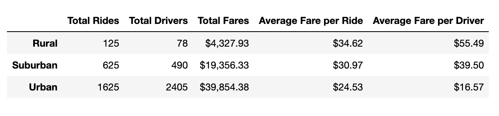
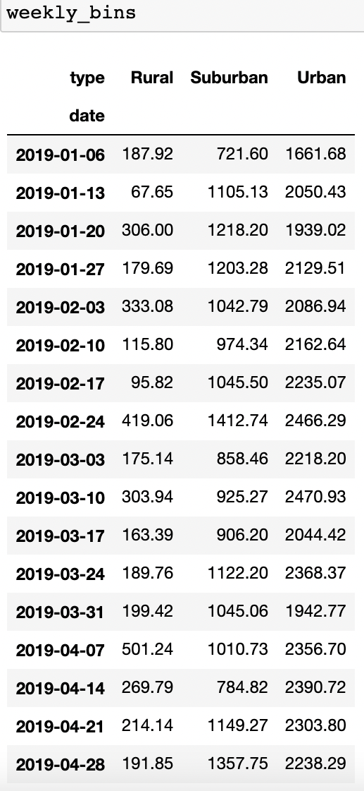
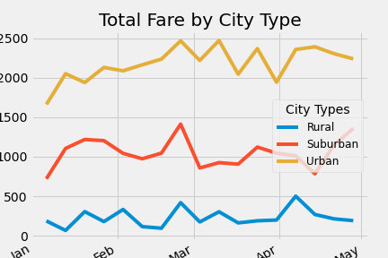

# PyBer_Analysis
Ride-Share Analytics

## Resources
- "Resources/city_data.csv"
- "Resources/ride_data.csv"
___
- Jupyter Notebook
- Python
- MatPlotLib
- Pandas
- NumPy

# Overview of the Analysis:
The purpose of the analysis was to present a written report that summarizes how the data differs by city type and how those differences can be used by decision-makers at PyBer. This analysis should accurately create a ride-sharing summary DataFrame by city type and a multiple-line chart of total fares for each city type. 

### Part 1 A Ride-sharing Summary DataFrame by City Type
The first portion requires a use of groupby(), count(), and sum() to create series' of data that will inhabit the summary as columns. After calculating the averages for the fares, the dataframe is displayed and then formatted. The pivot summary below shows the three city types and the counts and fare calculations for the following; "Total Rides", "Total Drivers", "Total Fares", "Average Fare per Ride", and "Average Fare per Driver". This was made using lambda, sum, groupby, and concat functions.

### Part 2 Multiple-line Chart of Total Fares for each City Type 
The second portion of the analysis can be completed by creating a new DataFrame, pivoting it to organize the table, sorting between JAN-APR, and then resampling the data into weekly sum() bins. The weekly bins store all of the rides and ouput the sum for each of the city types. This was made using datetime conversions, loc, resampling, and object-oriented interface plotting shown below in Results.

# Results:

As seen above, The pivot summary shows the three city types and their statistics for each category. This output of the fare calculations helps show trends between the city types. When looking at the results and takeaways from the pivot summary are that the main source of revenue for PyBer is from the urban marketplace and that the suburban market makes up a significant second portion of the revenue with $19,356. Another note is the average fare per driver for the rural type was highest at 55.49 at 60.2% higher than the average fee per ride.

The main goal of this final plot is create a line chart using the object-oriented interface method and format the data. The plot displays the urban market is the city type that creates the highest total of fares over the four month period. The graph doesnt show any outlier times that affected any of the city types.

# Summary:
The results above show the different averages of fares over the different city types. This information is important for future decision making as catering to the wrong demographic could lead to wasted funds. The Urban city type has an over abundance of drivers in the area which leads to the fare per driver being lower than the ride category. The urban city type could lose some of the drivers while the rest coould use more per ride. A recomendation would be to incentivize drivers to move to the suburban and rural areas. The urban area should be the focus as it has the highest potential, The first two categories for the summary shows that there is a large gap between the amount of rides and drivers. The company could work on increasing the amount of rides needed to make up for the abundance of drivers. The final analysis of the data shows that in the plot of the city types it seems all three categories trended up over the range but can be better seen in the Urban and Suburban categories. This shows most of the months looked positive except for the month of March where the three lines went negative or inconsistent. The urban city type increased the most over the period while the two other city types could use a more consistent floor.
