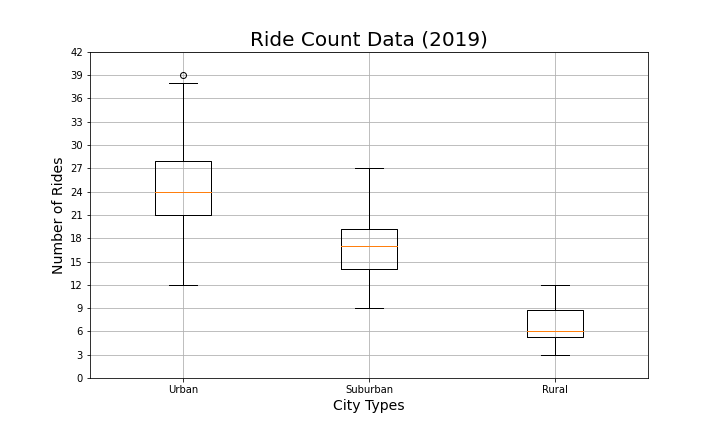

# PyBer_Analysis
Ride-Share Analytics

## Resources
- "Resources/city_data.csv"
- "Resources/ride_data.csv"
___
- Jupyter Notebook
- Python
- MatPlotLib
- Pandas
- NumPy

# Overview of the Analysis:
The purpose of the new analysis was to present a written report that summarizes how the data differs by city type and how those differences can be used by decision-makers at PyBer. This analysis should accurately create a ride-sharing summary DataFrame by city type and a multiple-line chart of total fares for each city type.

# Results:
Using images from the summary DataFrame and multiple-line chart, describe the differences in ride-sharing data among the different city types.
. Ride-sharing data include the total rides, total drivers, total fares, average fare per ride and driver, and total fare by city type. (7 pt)

# Summary:
Based on the results, provide three business recommendations to the CEO for addressing any disparities among the city types.
